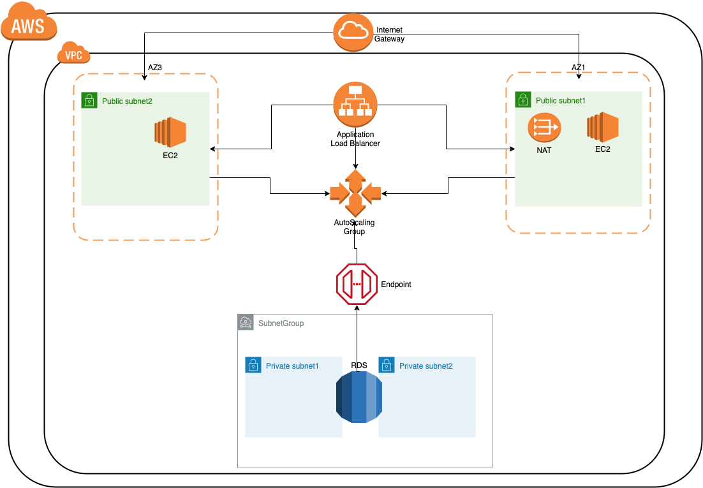

# Cloudformation-Stacks
    This project sets up a custom VPC to provision an RDS instance using MySQL configuration privately and
    deploying a sample web app publicly. RDS instance is deployed into private subnet group whereas 
    web app is deployed in public subnets. Application Load Balancer, Target Group, Launch Configuration
    and AutoScaling Group are configured accordingly. The stacks created by this project are nested.

## Infrastructure Diagram

## Files
    CloudFormation-Stacks repository consists of a total of five templates. 
    Following is the optimal sequence of uploading using Nested Stacks:
      1. Main, uploading this will create stacks for other templates.
      2. VPC 
      3. RDS 
      4. ELB 
      5. ASG 
 
### 1. Main
    In this template, all the other templates are in the form of multiple resources. 
    Nesting of stacks are done in accordance with this template.
### 2. VPC:
    In this template, provisioning of a custom VPC is done.
    It includes different resources related to VPC building, such as Subnets, Route Tables,
    InternetGateway, NAT Gateway, different Security Groups and so on.
    Internet Gateway is attached to the public subnets and Nat Gateway along with an Elastic IP
    attached to private subnets.
### 3. RDS:
    It has an RDS instance and it's configuration.
### 4. ELB:
    In this template, there is an internet-facing Application Load Balancer deployed into the
    public subnets. Listener to the port 80 (HTTP) is also configured. Moreover, a Target group is also 
    configured along with proper health checks for the public EC2 instances provisioned
    by the AutoScaling Group.
### 5. ASG:
    In this template, we have Launch Configuration and an AutoScaling Group for the public EC2 instances. 
    Launch Configuration also contains the user data for setting up different packages required for 
    this project.
